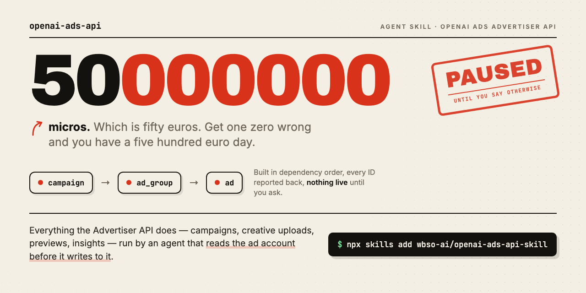

# openai-ads-api skill



An Agent Skill for the OpenAI Ads Advertiser API: ad accounts, creative uploads, campaigns,
ad groups, ads, conversion settings, previews, and insights. Uses the open `SKILL.md` format,
so it works in both Codex and Claude Code.

This repository contains exactly one skill; `SKILL.md` is at the root.

## Install

With the [skills CLI](https://skills.sh), which installs into Claude Code, Codex, Cursor,
OpenCode and other agents:

```bash
npx skills add wbso-ai/openai-ads-api-skill
```

Add `-a claude-code` or `-a codex` to target one agent. Update later with `npx skills update`.

Without the CLI, clone the repository into your agent's skills folder under the skill's own name:

```bash
git clone https://github.com/wbso-ai/openai-ads-api-skill ~/.claude/skills/openai-ads-api   # Claude Code
git clone https://github.com/wbso-ai/openai-ads-api-skill ~/.agents/skills/openai-ads-api   # Codex and the ~/.agents convention
```

Claude then loads the skill on its own, or on `/openai-ads-api`.

## Structure

```text
SKILL.md
agents/openai.yaml
references/api.md
assets/social.html   # source of the banner above
assets/social.png    # rendered with headless Chromium, also the GitHub social preview
```

The banner is plain HTML rendered at 1280x640:

```bash
chromium --headless=new --window-size=1280,640 --screenshot=assets/social.png assets/social.html
```

## Credentials

The skill never commits, prints, or documents real secret values. It first checks
`OPENAI_ADS_API_KEY`, then `~/.config/openai-ads/token`.

## Source of truth

The skill verifies operations against the official
[OpenAI Ads documentation](https://developers.openai.com/ads/api-quickstart) before use.
